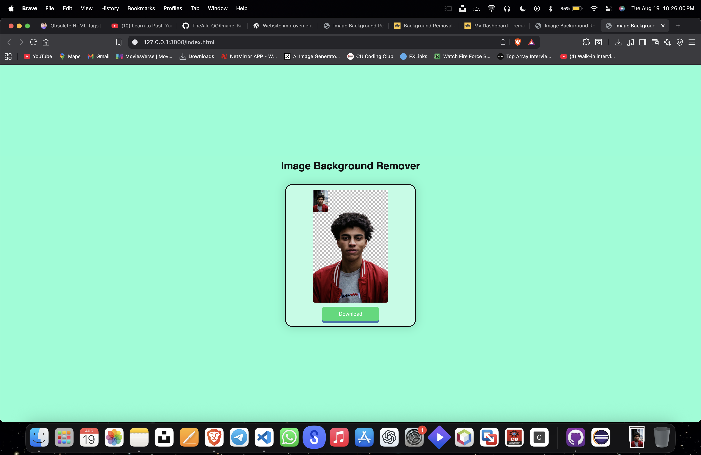
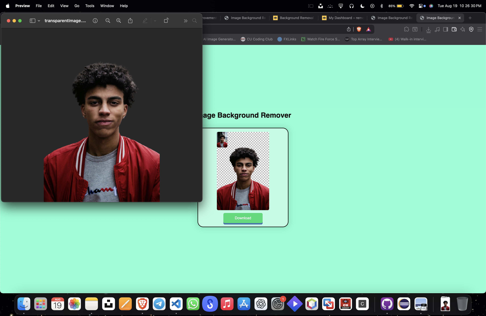

A simple web application that allows users to remove the background of images instantly using the Remove.bg API.

🚀 Features

Upload any image (JPG, PNG, etc.).

One-click background removal using AI.

Preview before & after images.

Download the final transparent image.

Clean & responsive UI (HTML, CSS, JavaScript).

🛠️ Tech Stack

HTML5 – Structure of the app.

CSS3 – Styling and responsive design.

JavaScript (Vanilla JS) – Functionality & API integration.

Remove.bg API – AI-powered background removal.

📂 Project Structure
├── index.html   # Main page  
├── style.css    # Styling file  
├── script.js    # Logic & API calls  
└── README.md    # Documentation  

⚡ How It Works

User uploads an image.

The app sends it to the Remove.bg API.

The API processes and returns a transparent PNG.

User can preview and download the result.

🔑 API Key Setup

To run this project, you need a Remove.bg API key:

Sign up at Remove.bg
.

Get your API key from the dashboard.

Open script.js and replace:

const API_KEY = "mfmYDT8JYX6kAxcMkL8We3GQ";

⚠️ Note: Free accounts have limited credits.

▶️ Run Locally

Clone the repo and open index.html in your browser:

git clone https://github.com/your-username/image-background-remover.git
cd image-background-remover

Then open index.html directly or use a local server:

npx serve

🌐 Demo

https://image-background-remover-mauve.vercel.app/

## 📸 Screenshots  

### Result After Removing Background  
  

### Downloaded Transparent Image  
  

📜 License

This project is licensed under the MIT License.